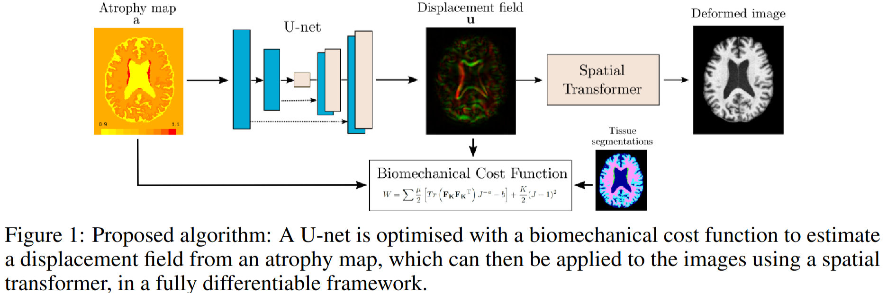
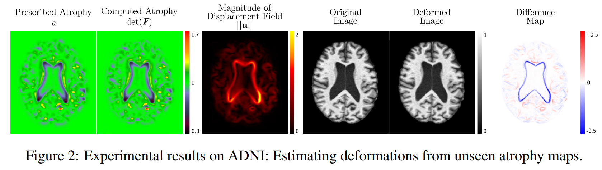

# [Biomechanical Simulation of Brain Atrophy Using Deep Networks](https://arxiv.org/abs/2012.07596)&middot; [](http://makeapullrequest.com) [](https://github.com/your/your-project/blob/master/LICENSE)<br><sub>Official PyTorch implementation </sub>

  

[Mariana da Silva](https://scholar.google.com/citations?user=0JWm1t0AAAAJ&hl=en), [Kara Garcia](https://scholar.google.com/citations?hl=en&user=75pPPrkAAAAJ), [Carole H. Sudre](hhttps://scholar.google.com/citations?hl=en&user=14GfvB4AAAAJ), [Cher Bass](https://scholar.google.com/citations?hl=en&user=wcuzZ2IAAAAJ), [M. Jorge Cardoso](https://scholar.google.com/citations?hl=en&user=BuJuSqkAAAAJ), and [Emma Robinson](https://scholar.google.com/citations?hl=en&user=WXAAOb0AAAAJ)

## Requirements

* Python libraries: See [requirements.txt](./requirements.txt) for library dependencies. You can use the following commands:

```bash
conda create -n simenv python=3.13  && conda activate simenv && pip install -r requirements.txt
```

## Data Preparation

The model takes `NIFTI` images and segmentations as input. Atrophies can be provided as an NIFTI volumetric file with the same dimentions of the images or as list of atrophies per region. For lists, you need to also provide the parcellations of the brain.

The atrophies correspond to local volume changes as defined below, such that `a = V1/V2`. This means that values of `1` correspond to no deformation, values `>1` correspond to atrophy and values `<1` correpond to expansion.

At training time, you need to provide segmentations, where label `0` corresponds to the background, `1` corresponds to the CSF and labels `>1` correspond to the brain tissue. The images do not need to be provided at training time.

At test time, you need to provide the baseline images and atrophy maps.

The code assumes that the atrophies, segmentations and images all have the same filename, e.g. `SubXXXX.nii.gz`, and that the train and test data are already separated in different folders.

## Training new models

### Training

The model can be trained using the following command:

```python
     python train.py --atr_path /path_to_atrophies/ --seg_path /path_to_segmentations/
```

### Testing

The model can be tested using the following command:

```python
     python test.py --atr_path /path_to_atrophies/ --img_path /path_to_images/ --load_model trained_model_3d.pt
```

### Inference

The model can be inferenced using the following command:

```python
     python generate.py --atr_path /path_to_atrophies/ --img_path /path_to_images/ --load_model trained_model_3d.pt
```

The results of model will be saved in the `./results` folder as `NIFTI` files. This includes the deformed images, calculated atrophies and deformation field.

## Example Results

  

## Cite this work [Arxiv]

```
@misc{dasilva2020biomechanicalmodellingbrainatrophy,
      title={Biomechanical modelling of brain atrophy through deep learning}, 
      author={Mariana da Silva and Kara Garcia and Carole H. Sudre and Cher Bass and M. Jorge Cardoso and Emma Robinson},
      year={2020},
      eprint={2012.07596},
      archivePrefix={arXiv},
      primaryClass={cs.LG},
      url={https://arxiv.org/abs/2012.07596}, 
}
```
